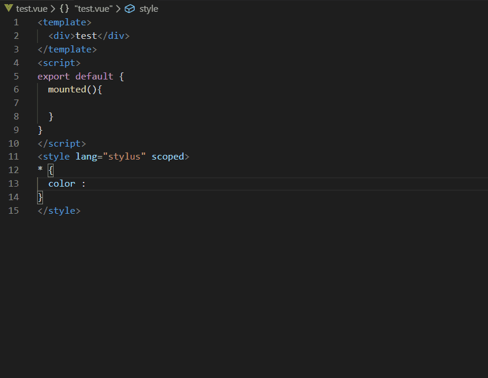

# vscode-elementui-scss-plugin

## vscode element-ui scss 变量自动补全插件

### 补全 scss
```sass
$-
```

scss 补齐字符  $--

### 补全 js
```javascript
$_
```

javascript 补课字符 $__

## It looks like this

<div align="center"></div>
